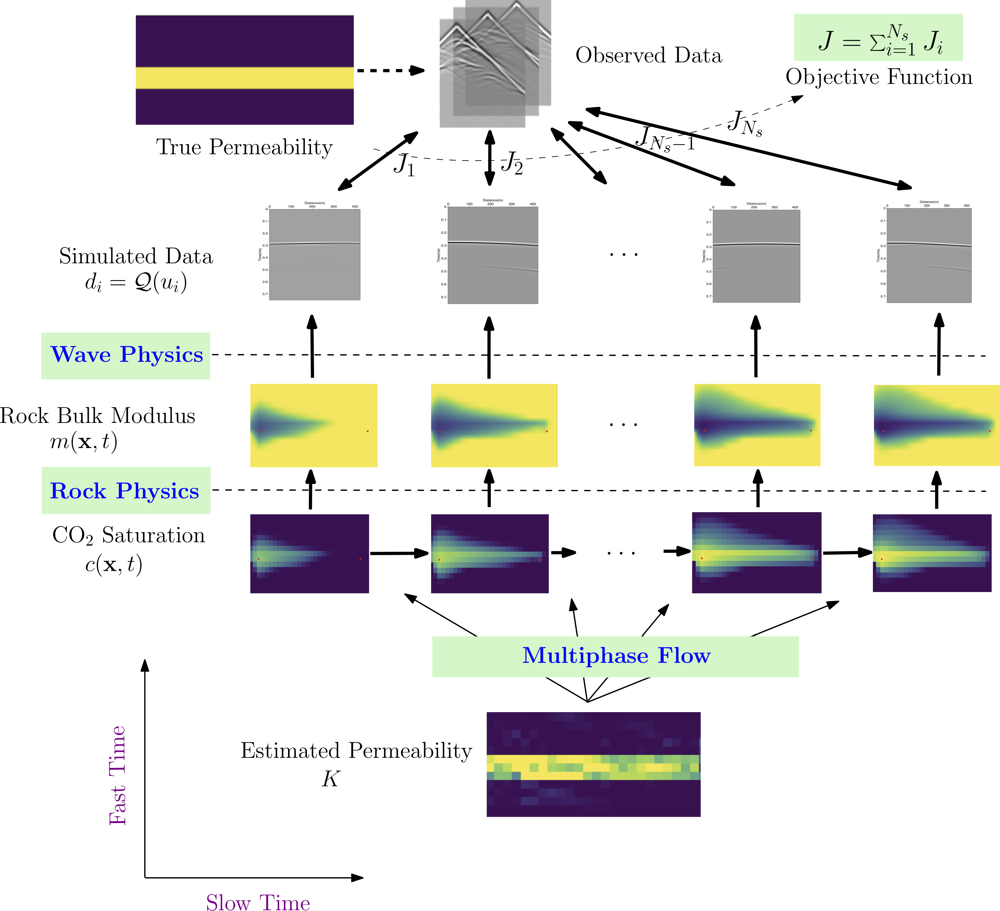
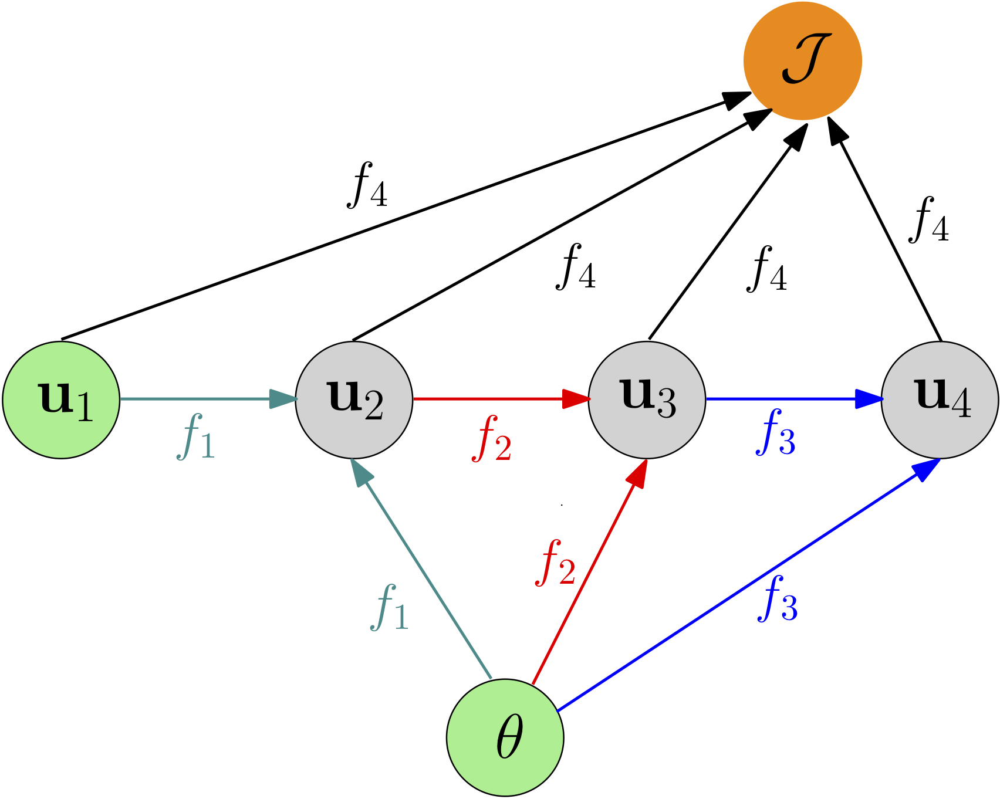

# Getting Started

### General Problem

This framework uses waveform data to invert for intrinsic parameters (e.g., permeability and porosity) in subsurface problems, with coupled flow physics, rock physics, and wave physics models.

## Physical Models

### Flow Physics
The flow physics component maps from intrinsic properties such as permeability to flow properties, such as fluid saturation. We use a model of two-phase flow in porous media as an example. The governing equations are convervation of mass, Darcy's law, and other relationships.

### Rock Physics
The rock physics model describes the relationship between fluid properties and rock elastic properties. As one fluid phase displaces the other, the bulk modulus and density of rocks vary. 

### Wave Physics
The elastic wave equation maps from elastic properties to wavefields, such as particle velocity and stress, which can be recorded by receiver arrays as seismic waveform data.

The elastic wave equation maps from elastic properties to wavefields, such as particle velocity and stress, which can be recorded by receiver arrays as seismic waveform data.

## Intelligent Automatic Differentiation

The Intelligent Automatic Differentiation method provides three levels of user control with (1) built-in differentiable operators from modern deep-learning infrastructures (TensorFlow), and customized operators that can either (2) encapsulate analytic adjoint gradient computation or (3) handle the forward simulation and compute the corresponding gradient for a single time step. This intelligent strategy strikes a good balance between computational efficiency and programming efficiency and would serve as a paradigm for a wide range of PDE-constrained geophysical inverse problems.

###	The Adjoint Method & Automatic Differentation

### The Adjoint Method & Automatic Differentation

### Customized Operators

###	Customized Operators

