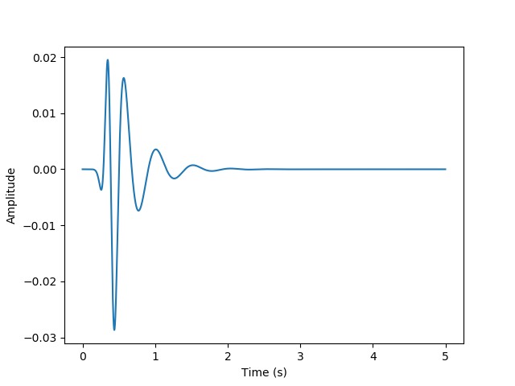
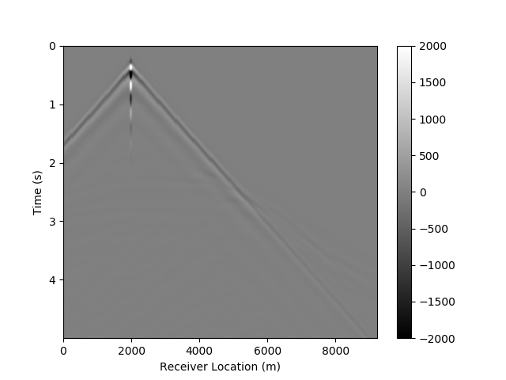

# FWI

In this example, we perform full-waveform inversion with FwiFlow. 

First we load all necessary packages
```julia
using FwiFlow
using PyCall
using LinearAlgebra
using DelimitedFiles
np = pyimport("numpy")
sio = pyimport("scipy.io")
```


 We specify the parameters for the computational domain and numerical methods. 
```julia
oz = 0.0 # original depth
ox = 0.0
dz_orig = 24.0 # original scale
dx_orig = 24.0 # original scale
nz_orig = 134 # original scale
nx_orig = 384 # original scale
dz = dz_orig/1.0
dx = dx_orig/1.0
nz = Int64(round((dz_orig * nz_orig) / dz));
nx = Int64(round((dx_orig * nx_orig) / dx))
dt = 0.0025
nSteps = 2000

para_fname = "para_file.json"
survey_fname = "survey_file.json"
data_dir_name = "Data"
```

```julia
nPml = 32
nPad = 32 - mod((nz+2*nPml), 32)
nz_pad = nz + 2*nPml + nPad
nx_pad = nx + 2*nPml
Mask = zeros(nz_pad, nx_pad)
Mask[nPml+1:nPml+nz, nPml+1:nPml+nx] .= 1.0
Mask[nPml+1:nPml+10,:] .= 0.0
tf_mask = constant(Mask)
tf_mask_neg = constant(1.0 .- Mask)
```


```julia
filter = [[0.0, 0.0, 2.0, 2.5],
        [0.0, 0.0, 2.0, 3.5],
        [0.0, 0.0, 2.0, 4.5],
        [0.0, 0.0, 2.0, 5.5],
        [0.0, 0.0, 2.0, 6.5],
        [0.0, 0.0, 2.0, 7.5]]

f0_vec = [4.5]
ind_src_x = collect(4:8:384)
ind_src_z = 2ones(Int64, size(ind_src_x))
ind_rec_x = collect(3:381)
ind_rec_z = 2ones(Int64, size(ind_rec_x))
```


```julia
stf_load = Matrix{Float64}(undef, 1, nSteps)
stf_load[1,:] = sio.loadmat("$(DATADIR)/sourceF_4p5_2_high.mat", squeeze_me=true, struct_as_record=false)["sourceF"]
```



```julia
tf_stf_array = tf.broadcast_to(constant(stf_load), [length(ind_src_z), nSteps])
```

```julia
cp_true_pad = reshape(reinterpret(Float32,read("$DATADIR/Model_Cp_true.bin"))          , (nz_pad, nx_pad))
cs_true_pad = zeros(nz_pad, nx_pad)
den_true_pad = 2500.0 .* ones(nz_pad, nx_pad)

tf_cp_pad = Variable(cp_true_pad, dtype=Float64) # original scale as 
tf_cs_pad = constant(cs_true_pad, dtype=Float64)
tf_den_pad = constant(den_true_pad, dtype=Float64)

function vel2moduli(cp,cs,den)
    lambda = (cp^2 - 2.0 * cs^2) .* den / 1e6
    mu = cs^2 .* den / 1e6
    return lambda, mu
end
tf_lambda_inv_pad, tf_mu_inv_pad = vel2moduli(tf_cp_pad, tf_cs_pad, tf_den_pad)
```

```julia
paraGen(nz_pad, nx_pad, dz, dx, nSteps, dt, f0_vec[1], nPml, nPad, para_fname, survey_fname, data_dir_name)
surveyGen(ind_src_z, ind_src_x, ind_rec_z, ind_rec_x, survey_fname)
```

We generated two files:

1. `para_file.json`
```json
{"nz":224,"nx":448,"dz":24.0,"dx":24.0,"nSteps":2000,"dt":0.0025,"f0":4.5,"nPoints_pml":32,"nPad":26,"survey_fname":"survey_file.json","data_dir_name":"Data"}
```
2. `survey_file.json`
```json
{"nShots":48,"shot0":{"z_src":2,"x_src":4,"nrec":379,"z_rec":[2,2,2,2,2,...
```


```julia
tf_shot_ids = collect(0:length(ind_src_z)-1)
loss = fwi_obs_op(tf_lambda_inv_pad, tf_mu_inv_pad, tf_den_pad, tf_stf_array, 0, tf_shot_ids, para_fname) # use GPU:0

sess = Session(); init(sess);
run(sess, loss)
```

In the `Data` folder, there will be 47 `Shot*.bin` files. We can visualize the result
```julia
A=read("Data/Shot10.bin");imshow(reshape(reinterpret(Float32,A),(nSteps ,length(ind_rec_z))), aspect="auto", vmax=2000, vmin=-2000, extent=[0, nx*dx, dt*(nSteps-1), 0])
xlabel("Receiver Location (m)")
ylabel("Time (s)")
colorbar()
set_cmap("gray")
```



Inversion 


```julia
cs_init_pad = zeros(nz_pad, nx_pad)
den_init_pad = 2500.0 .* ones(nz_pad, nx_pad)
cp_init_pad = reshape(reinterpret(Float32,read("$DATADIR/Model_Cp_init_1D.bin")), (nz_pad, nx_pad))
tf_cp_inv = Variable(cp_init_pad[nPml+1:nPml+nz, nPml+1:nPml+nx], dtype=Float64) # original scale as 
tf_cs_inv = constant(cs_init_pad[nPml+1:nPml+nz, nPml+1:nPml+nx], dtype=Float64)
tf_den_inv = constant(den_init_pad[nPml+1:nPml+nz, nPml+1:nPml+nx], dtype=Float64)
tf_cp_ref_pad = constant(cp_init_pad, dtype=Float64) # original scale as 
tf_cs_ref_pad = constant(cs_init_pad, dtype=Float64)
tf_den_ref_pad = constant(den_init_pad, dtype=Float64)
tf_cp_inv_pad, tf_cs_inv_pad, tf_den_inv_pad = padding(tf_cp_inv, tf_cs_inv, 
    tf_den_inv, nz_orig, nx_orig, nz, nx, nPml, nPad)
```

```julia
tf_cp_msk_pad = tf_cp_inv_pad .* tf_mask + tf_cp_ref_pad .* tf_mask_neg
tf_cs_msk_pad = tf_cs_inv_pad .* tf_mask + tf_cs_ref_pad .* tf_mask_neg
tf_den_msk_pad = tf_den_inv_pad .* tf_mask + tf_den_ref_pad .* tf_mask_neg
tf_lambda_inv_pad, tf_mu_inv_pad = vel2moduli(tf_cp_msk_pad, tf_cs_msk_pad,tf_den_msk_pad)
```

```julia
loss = constant(0.0)
nGpus = length(use_gpu())
shot_id_points = Int32.(trunc.(collect(LinRange(0, length(ind_src_z)-1, nGpus+1))))

loss = constant(0.0)
for i = 1:nGpus
    global loss
    tf_shot_ids = collect(shot_id_points[i]:shot_id_points[i+1])
    loss += fwi_op(tf_lambda_inv_pad, tf_mu_inv_pad, tf_den_inv_pad, 
            tf_stf_array, i-1, tf_shot_ids, para_fname)
end
```

```julia
sess = Session(); init(sess)
BFGS!(sess, loss)
```